## 1. 목표와 기능
### 1.1 목표
- Python, Django Framework를 활용한 블로그 설계
- 기획 및 구현, 배포까지 1사이클 경험
- 모놀리식 아키텍쳐 설계
- CBV(Class-Based View)
- WBS, ERD 설계 경험
- 문서 작성 경험
### 1.2 기능
- 공통
  - 토글 - 회원가입 / 로그인 버튼
  - 토글 메뉴 - 프로필 / 로그아웃
  - 검색
  - 카테고리, 해당 카테고리 목록 카운트
  - 홈버튼
- 메인페이지
  - 게시글 리스트
  - 게시글 작성
- 상세페이지
  - 해당 게시글 수정 및 삭제
  - 제목, 작성자, 조회수, 작성 시간, 수정 시간, 카테고리
  - 이미지, 본문, 파일 다운로드, 댓글 CRUD, 대댓글
- 로그인페이지
  - 일반 로그인 / 구글 로그인
  - 회원가입
- 프로필페이지
  - 프로필 이미지 
  - 썸네일 이미지
  - 프로필 편집
- 프로필 편집페이지
  - 이름, 성, 닉네임, 프로필사진, 비밀번호 수정

### 1.3 팀 구성
- 개인 프로젝트

## 2. 개발 환경 및 배포 URL
### 2.1 개발 환경
  - Web Framework
    - Django 5.0.3 (Python 3.11.7)
  - 서비스 배포 환경
    - Amazon Lightsail
### 2.2 배포 URL
  - [URL](http://43.202.29.72:8000/blog/)
  - 관리자
    ```
    id : pjh
    pw : pjh1234!!
    ```
  - 일반 유저
    ```
    id : pjh1
    pw : pjh11234!!
    ```
  - 구글 로그인 유저
### 2.3 URL 구조(모놀리식)
- #### Config (main)
| App       | URL                                        | Views Function    | HTML File Name                        | Note           |
|-----------|--------------------------------------------|-------------------|---------------------------------------|----------------|
|admin      |	'/admin/'	| -	|-	|관리자 화면|
|-	  |'/'	|RedirectView.as_view() |	-	|메인 화면 |
|blog	|'/blog/'	|-	|-	|blog.urls 내의 URL 패턴 참조|
|markdownx	|'/markdownx/'	|-	|-	| 본문 markdown 적용 |
|accounts	|'/accounts/'	|-	|-	| allauth |
|-	|'/media/'	|-	|-	|미디어 파일 접근을 위한 URL|


- #### Accounts (Django Allauth)

accounts 앱은 사용자 인증 및 관리를 위해 Django 프로젝트에 통합된 앱입니다. 이 앱은 django-allauth 패키지를 사용하여 구현되었으며, 사용자 로그인, 로그아웃, 회원가입, 소셜 로그인 등의 기능을 제공합니다. 이를 통해 사용자 경험(UX)을 대폭 향상합니다.

#### 기능
- 회원가입: 사용자는 이메일 주소, 아이디, 비밀번호를 사용하여 계정을 생성할 수 있습니다. 

- 로그인/로그아웃: 사용자는 아이디와 비밀번호를 사용하여 로그인할 수 있으며, 로그아웃도 가능합니다.

- 소셜 로그인: 페이스북, 구글, 트위터 등 여러 소셜 미디어 계정을 사용하여 로그인할 수 있습니다.

- 계정 관리: 사용자는 비밀번호 변경, 이메일 주소 추가 및 변경 등의 계정 관리 기능을 사용할 수 있습니다. 
  
- 비밀번호 재설정: 비밀번호를 잊은 사용자는 이메일을 통해 비밀번호를 재설정할 수 있습니다.


- #### Blog 


| App       | URL                                        | Views Function    | HTML File Name                        | Note           |
|-----------|--------------------------------------------|-------------------|---------------------------------------|----------------|
|blog	|'blog/'				|PostList.as_view()		|blog/post_list.html		|게시판 메인 화면|
|blog	|'blog/int:pk/'				|PostDetail.as_view()		|blog/post_detail.html		|상세 게시글 화면|
|blog	|'blog/category/str:slug/'		|category_page			|blog/post_list.html	        |카테고리별 게시글 보기|
|blog	|'blog/tag/str:slug/'			|tag_page			|blog/post_list.html		|태그별 게시글 보기|
|blog	|'blog/create_post/'			|PostCreate.as_view()		|blog/post_form.html		|게시글 작성|
|blog	|'blog/update_post/int:pk/'		|PostUpdate.as_view()		|blog/post_update_form.html	|게시글 수정|
|blog	|'blog/delete_post/int:pk/'		|PostDelete.as_view()		|blog/post_list.html   	        |게시글 삭제|
|blog	|'blog/search/str:q/'			|PostSearch.as_view()		|blog/post_list.html		|검색 기능|
|blog	|'blog/int:pk/create_comment/'		|create_comment			|blog/post_detail.html		|댓글 입력 폼|
|blog	|'blog/update_comment/int:pk/'		|CommentUpdate.as_view()	|blog/comment_form.html		|댓글 업데이트|
|blog	|'blog/delete_comment/int:pk/'		|delete_comment 		|blog/post_detail.html          |댓글 삭제|
|blog	|'blog/create_recomment/int:pk/'	|create_recomment		|blog/post_detail.html 	        |대댓글 입력 폼 |
|blog	|'blog/update_recomment/int:pk/'	|ReCommentUpdate.as_view()	|blog/recomment_form.html 	|대댓글 업데이트|
|blog	|'blog/delete_recomment/int:pk/'	|delete_recomment 		|blog/post_detail.html          |대댓글 삭제|
|blog	|'blog/profile/int:pk/'			|profile			|blog/profile.html		|프로필 보기|
|blog	|'blog/update_profile/int:pk/'		|ProfileUpdate.as_view()	|blog/profile_update.html	|프로필 업데이트|
|blog	|'blog/change_password/'		|ChangePassword.as_view()	|blog/change_password.html	|비밀번호 변경|

## 3. 기능 명세
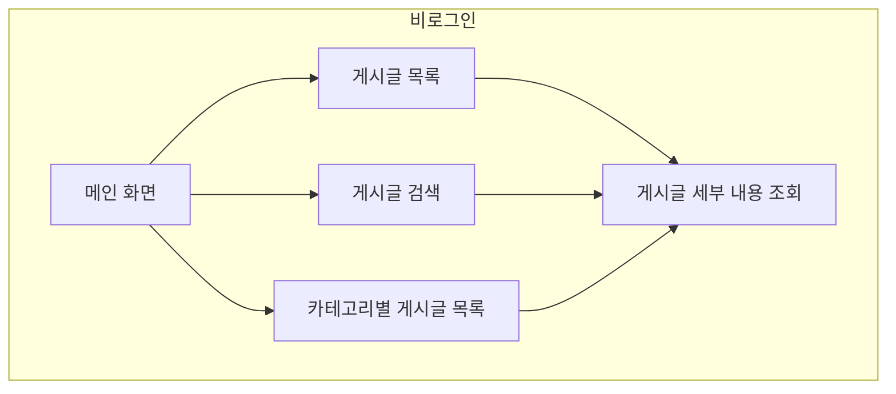

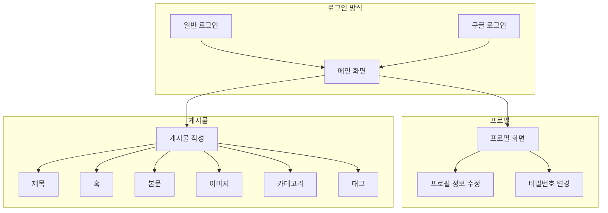

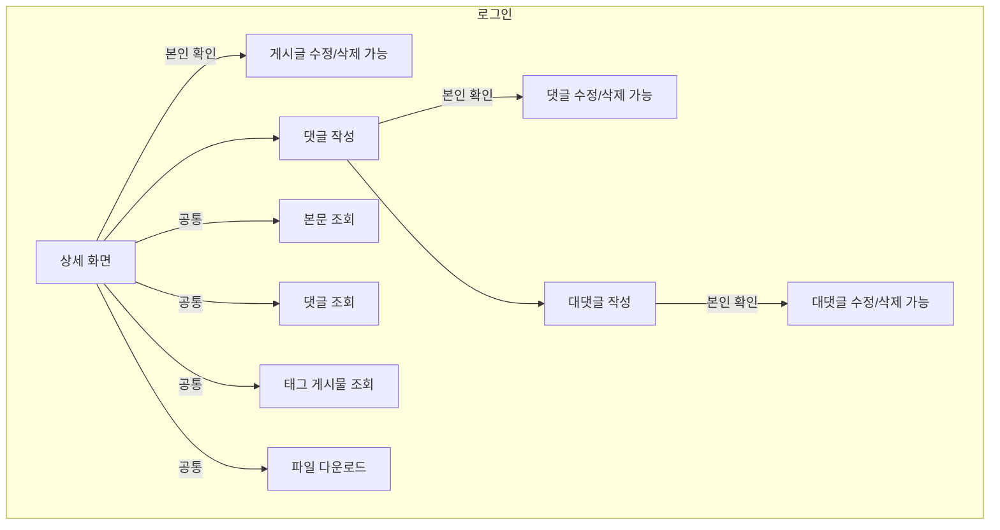
    
## 4. 프로젝트 구조와 개발 일정
### 4.1 프로젝트 구조
```
📦my-hobby-blog
 ┣ 📂accounts
 ┣ 📂blog
 ┃ ┣ 📂static
 ┃ ┃ ┗ 📂blog
 ┃ ┃ ┃ ┣ 📂bootstrap
 ┃ ┃ ┃ ┃ ┣ 📂assets
 ┃ ┃ ┃ ┃ ┃ ┗ 📜favicon.ico
 ┃ ┃ ┃ ┃ ┣ 📂css
 ┃ ┃ ┃ ┃ ┃ ┗ 📜styles.css
 ┃ ┃ ┃ ┃ ┣ 📂js
 ┃ ┃ ┃ ┃ ┃ ┗ 📜scripts.js
 ┃ ┃ ┃ ┃ ┗ 📜index.html
 ┃ ┃ ┃ ┗ 📂images
 ┃ ┃ ┃ ┃ ┗ 📜default_profile.png
 ┃ ┣ 📂templates
 ┃ ┃ ┗ 📂blog
 ┃ ┃ ┃ ┣ 📜base.html
 ┃ ┃ ┃ ┣ 📜base_full_width.html
 ┃ ┃ ┃ ┣ 📜comment_form.html
 ┃ ┃ ┃ ┣ 📜post_detail.html
 ┃ ┃ ┃ ┣ 📜post_form.html
 ┃ ┃ ┃ ┣ 📜post_list.html
 ┃ ┃ ┃ ┣ 📜post_update_form.html
 ┃ ┃ ┃ ┣ 📜profile.html
 ┃ ┃ ┃ ┣ 📜profile_update.html
 ┃ ┃ ┃ ┗ 📜recomment_form.html
 ┃ ┣ 📜admin.py
 ┃ ┣ 📜apps.py
 ┃ ┣ 📜forms.py
 ┃ ┣ 📜models.py
 ┃ ┣ 📜tests.py
 ┃ ┣ 📜urls.py
 ┃ ┣ 📜views.py
 ┃ ┗ 📜__init__.py
 ┣ 📂config
 ┃ ┣ 📜asgi.py
 ┃ ┣ 📜settings.py
 ┃ ┣ 📜urls.py
 ┃ ┣ 📜wsgi.py
 ┃ ┗ 📜__init__.py
 ┣ 📂media
 ┃ ┣ 📂blog
 ┃ ┃ ┣ 📂files
 ┃ ┃ ┃ ┗ 📂2024
 ┃ ┃ ┃ ┃ ┗ 📂03
 ┃ ┃ ┃ ┃ ┃ ┣ 📂07
 ┃ ┃ ┃ ┃ ┃ ┃ ┣ 📜test.txt
 ┃ ┃ ┃ ┃ ┃ ┃ ┗ 📜test.xlsx
 ┃ ┃ ┃ ┃ ┃ ┗ 📂11
 ┃ ┃ ┃ ┃ ┃ ┃ ┣ 📜test.txt
 ┃ ┃ ┃ ┃ ┃ ┃ ┗ 📜test.xlsx
 ┃ ┃ ┗ 📂images
 ┃ ┃ ┃ ┣ 📂2024
 ┃ ┃ ┃ ┃ ┗ 📂03
 ┃ ┃ ┃ ┃ ┃ ┣ 📂07
 ┃ ┃ ┃ ┃ ┃ ┃ ┗ 📜자연이미지.jpg
 ┃ ┃ ┃ ┃ ┃ ┗ 📂11
 ┃ ┃ ┃ ┃ ┃ ┃ ┗ 📜자연이미지.jpg
 ┃ ┃ ┃ ┗ 📂thumbnail
 ┃ ┃ ┃ ┃ ┗ 📂2024
 ┃ ┃ ┃ ┃ ┃ ┗ 📂03
 ┃ ┃ ┃ ┃ ┃ ┃ ┗ 📂12
 ┃ ┃ ┃ ┃ ┃ ┃ ┃ ┣ 📜default_profile.png
 ┃ ┃ ┃ ┃ ┃ ┃ ┃ ┣ 📜보드와테이블.jpg
 ┃ ┃ ┃ ┃ ┃ ┃ ┃ ┣ 📜석양과도시.jpg
 ┃ ┃ ┃ ┃ ┃ ┃ ┃ ┣ 📜섬과바다.jpg
 ┃ ┃ ┃ ┃ ┃ ┃ ┃ ┣ 📜자연이미지.jpg
 ┃ ┃ ┃ ┃ ┃ ┃ ┃ ┗ 📜햇빛이미지.jpg
 ┣ 📂templates
 ┃ ┣ 📂account
 ┃ ┣ 📂allauth
 ┣ 📜db.sqlite3
 ┣ 📜manage.py
 ┣ 📜README.md
 ┗ 📜requirements.txt
```
### 4.2 WBS
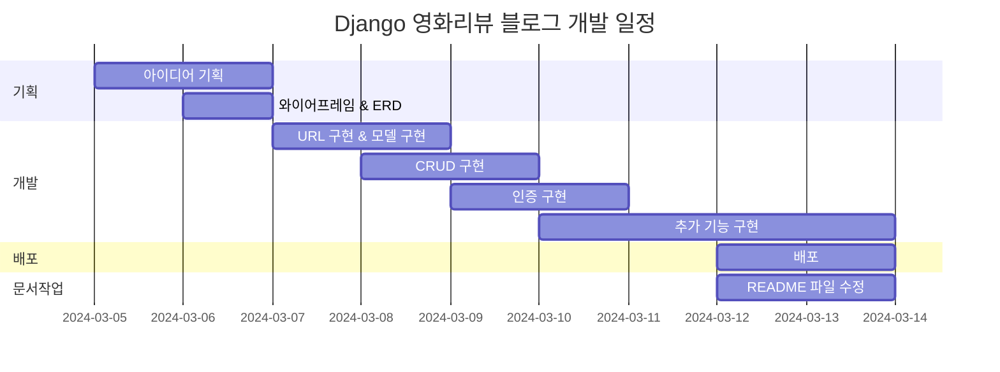

## 5. 와이어프레임 / UI
### 5.1 와이어프레임
<table>
    <tbody>
        <tr>
            <td>메인 화면</td>
            <td>상세 게시글 화면</td>
        </tr>
        <tr>
            <td>
		
            </td>
            <td>
                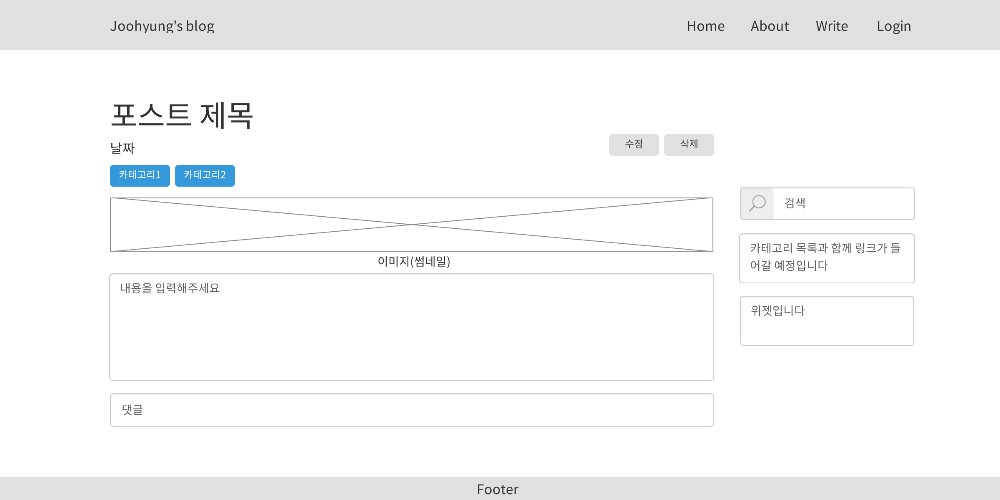
            </td>
        </tr>
        <tr>
            <td>카테고리 조회</td>
            <td>태그 조회</td>	
        </tr>
        <tr>
            <td>
                
            </td>
            <td>
                
            </td>
        </tr>
        <tr>
            <td>게시글 작성</td>
            <td>게시글 수정</td>
        </tr>
        <tr>
            <td>
                
            </td>
            <td>
                
            </td>
        </tr>
        <tr>
            <td>댓글</td>
            <td>로그인</td>
        </tr>
        <tr>
            <td>
	        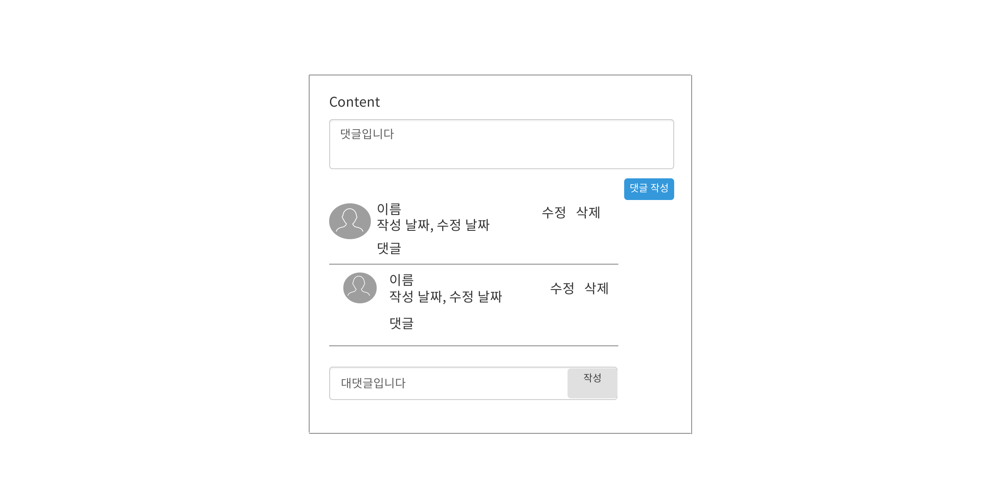
            </td>
            <td>
                
            </td>
        </tr>
        <tr>
            <td>회원가입</td>
            <td>아이디 찾기</td>
        </tr>
        <tr>
            <td>
                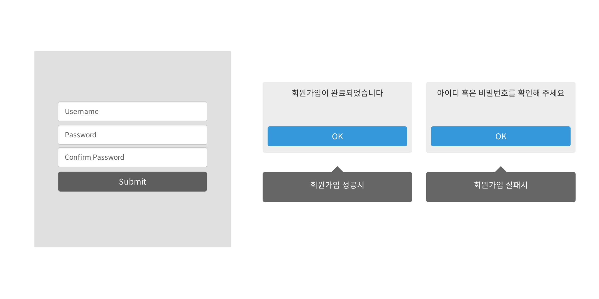
            </td>
	    <td>
                
            </td>
        </tr>
	<tr>
            <td>비밀번호 찾기</td>
            <td>비밀번호 변경</td>
        </tr>
        <tr>
            <td>
                
            </td>
	    <td>
                
            </td>
        </tr>
 	<tr>
            <td>프로필</td>
            <td>프로필 수정</td>
        </tr>
        <tr>
            <td>
                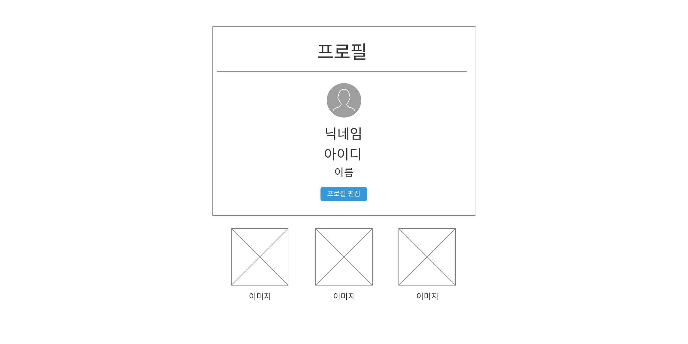
            </td>
	    <td>
                
            </td>
        </tr>
    </tbody>
</table>

### 5.2 화면 설계
<table>
    <tbody>
        <tr>
            <td>메인 상단</td>
            <td>메인하단</td>
        </tr>
        <tr>
            <td>
		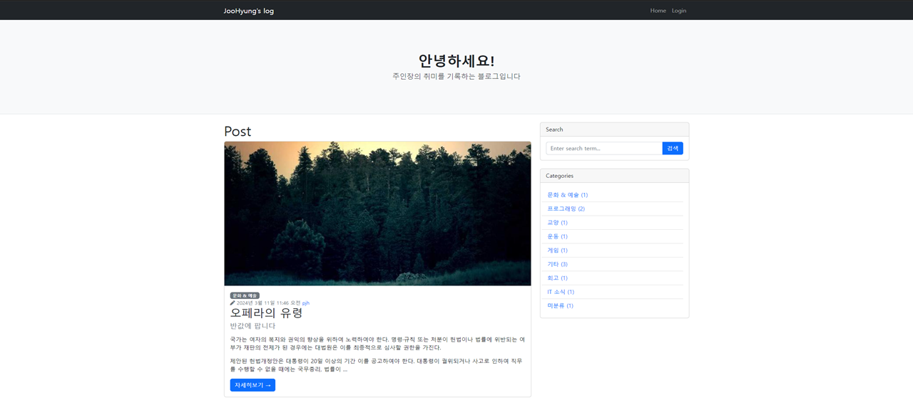
            </td>
            <td>
                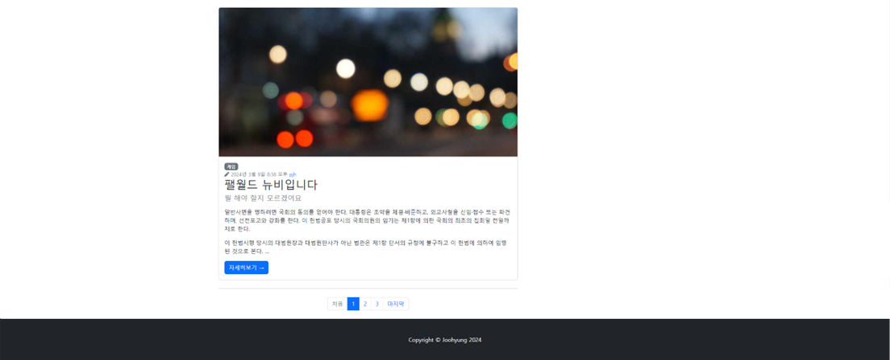
            </td>
        </tr>
        <tr>
            <td>상세 게시물</td>
            <td>카테고리 조회</td>	
        </tr>
        <tr>
            <td>
                
            </td>
            <td>
                
            </td>
        </tr>
        <tr>
            <td>태그 조회</td>
            <td>게시글 작성</td>
        </tr>
        <tr>
            <td>
                
            </td>
            <td>
                
            </td>
        </tr>
        <tr>
           <td>게시글 수정</td>
           <td>댓글</td>
        </tr>
        <tr>
            <td>
	        
            </td>
            <td>
                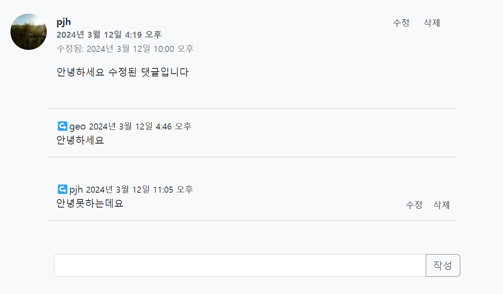
            </td>
        </tr>
        <tr>
            <td>로그인</td>
            <td>구글 로그인</td>
        </tr>
        <tr>
            <td>
                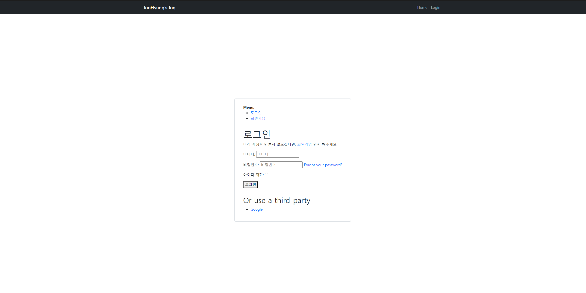
            </td>
            <td>
                
            </td>
        </tr>
	 <tr>
            <td>회원가입</td>
            <td>비밀번호 수정</td>
        </tr>
        <tr>
            <td>
                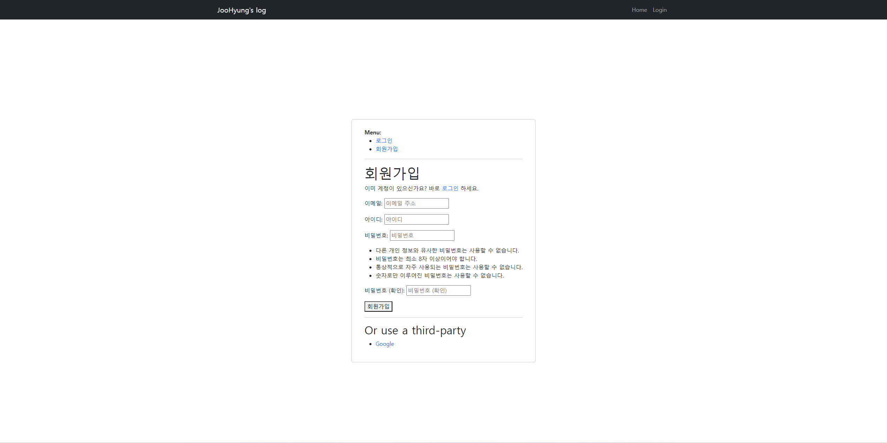
            </td>
	    <td>
                
            </td>
        </tr>
 	<tr>
            <td>프로필</td>
            <td>프로필 수정</td>
        </tr>
        <tr>
            <td>
                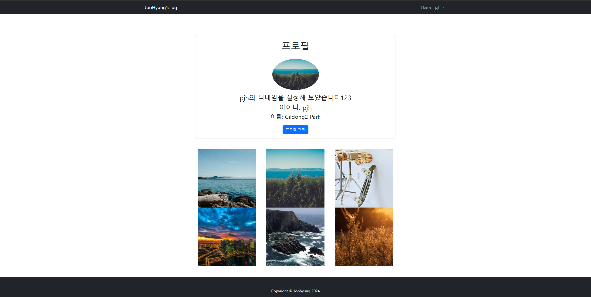
            </td>
	    <td>
                
            </td>
        </tr>
    </tbody>
</table>

## 6. 데이터베이스 모델링(ERD)


## 7. 트러블슈팅 및 개선
### 7.1 관리자 화면 레이아웃 오류
관리자 페이지의 기능들은 정상 작동하지만 레이아웃이 정상 출력되지 않는 오류가 발생하였다.


조사 결과, 해결책은 2가지였다. 
1. Django 버전 다운그레이드
   - 5.0.3 -> 3.2.14로 낮춰서 해결이 가능하였다.
2. 캐시 제거
   - 관리자 화면에서 CTRL + SHIFT + R을 눌러 캐시를 제거하여 해결하였다.

### 7.2 IntegrityError 오류
```
IntegrityError at /post/new/ NOT NULL constraint failed: blog_post.author_id
```

게시글 생성 view를 만들고 나서 해당 URL로 폼을 작성하고 저장을 하니 위와 같은 오류가 발생하였다. CBV로 선언한 PostCreate 클래스 내부에 form_valid라는 폼을 검증하는 함수를 추가하여 author를 자동으로 추가하게끔 작성하여 해결하였다.
```
    def form_valid(self, form):
        current_user = self.request.user
        if current_user.is_authenticated:
            form.instance.author = current_user
            return super(PostCreate, self).form_valid(form)
        else:
            return redirect("/blog/")
```

### 7.3 UNIQUE constraint failed 오류
```
UNIQUE constraint failed: blog_tag.slug
```
게시글 작성 시 태그를 태그1; 태그2 로 작성하면 정상 반영되지만 태그1; 태그2; 처럼 마지막을 세미콜론(;)으로 끝내면 위와 같은 오류가 발생한다. 
일반적인 경우에서는 일어나지 않을 오류이지만 본인과 같은 실수를 예방하고자 view에서 PostCreate 클래스의 form_valid라는 폼 유효성 함수 내부에 다음과 같은 코드를 추가하여 해결하였다.
```
tags_str = tags_str.strip("; ")
```

### 7.4 게시글 삭제 관련 로직 단순화

기존 코드는 게시글 세부 화면에서 삭제를 누르면 다른 페이지로 이동하여 삭제를 진행하였는데 이 과정에서 불편함을 느꼈으며 다음과 같이 수정하였다. 
```
<form class="post-form d-inline" action=""
method="post">
    
    <a href="">
    <input type="submit" value="확인" class="btn btn-primary">
    </a>
</form>
```
확인 버튼을 form 태그로 감싸고 post_delete라는 이름의 삭제 클래스 URL과 연결시켰다. 그 다음, views의 삭제 클래스 내부 get함수를 오버라이딩 하였다.
```
class PostDelete(DeleteView):
    model = Post
    success_url = reverse_lazy("post_list")

    def get(self, request, *args, **kwargs):
        return self.post(request, *args, **kwargs)
```
결과적으로 삭제 버튼을 누르면 바로 삭제가 되어 지연 시간을 확실히 감소시켰다.


## 8. 개발하며 느낀점


