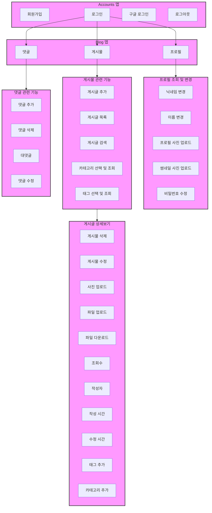
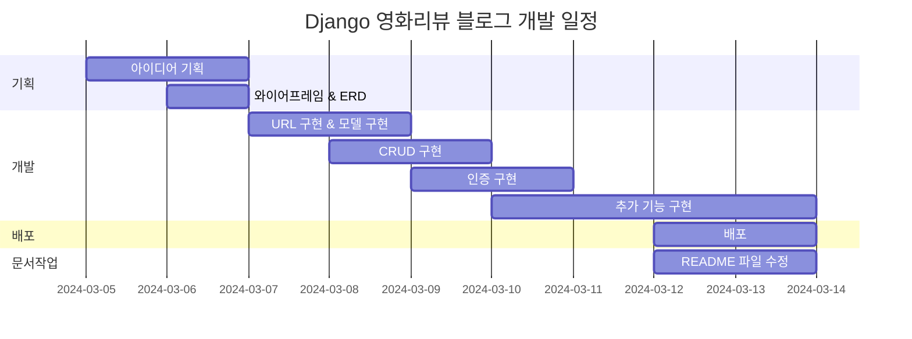
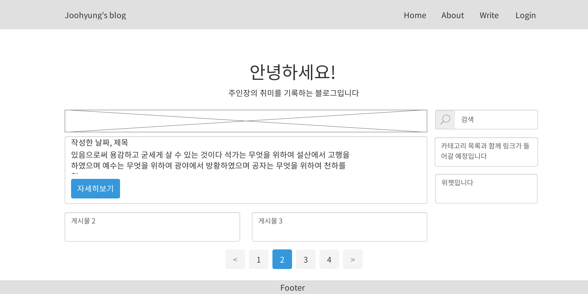
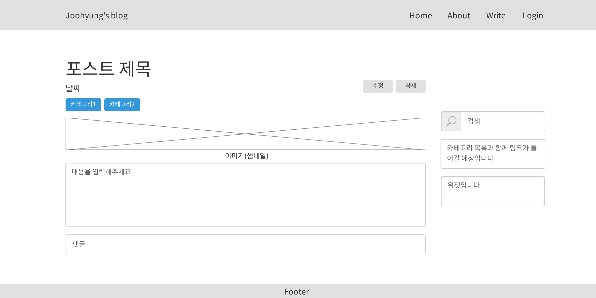
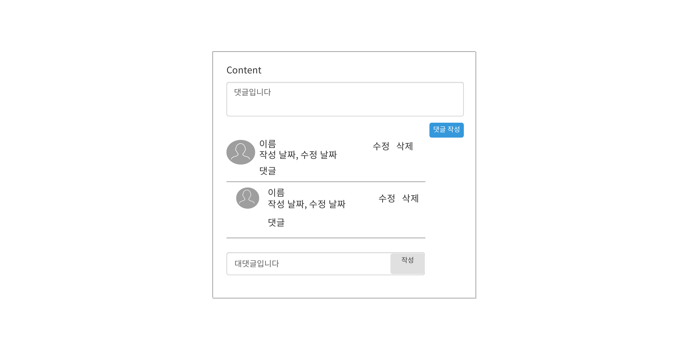
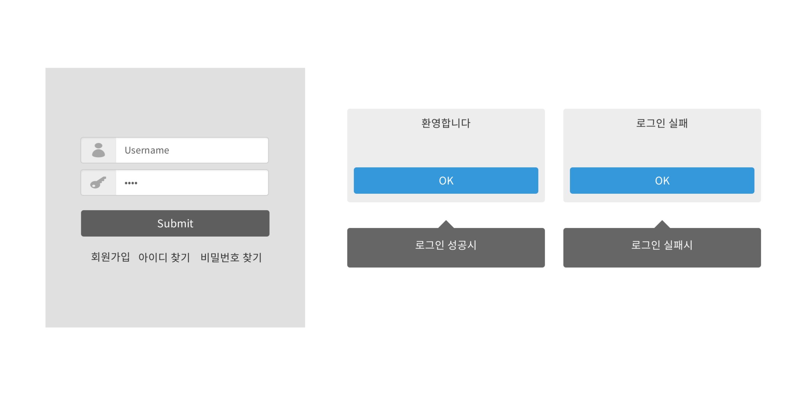
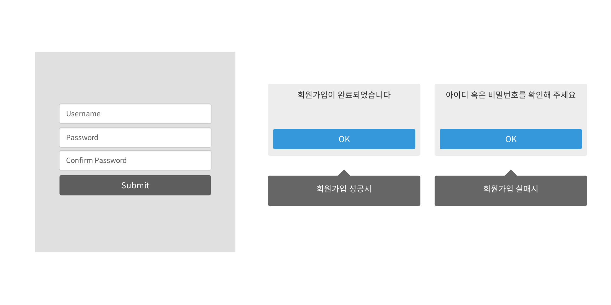
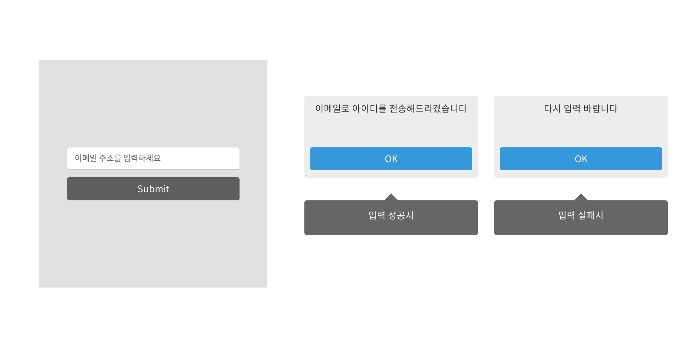
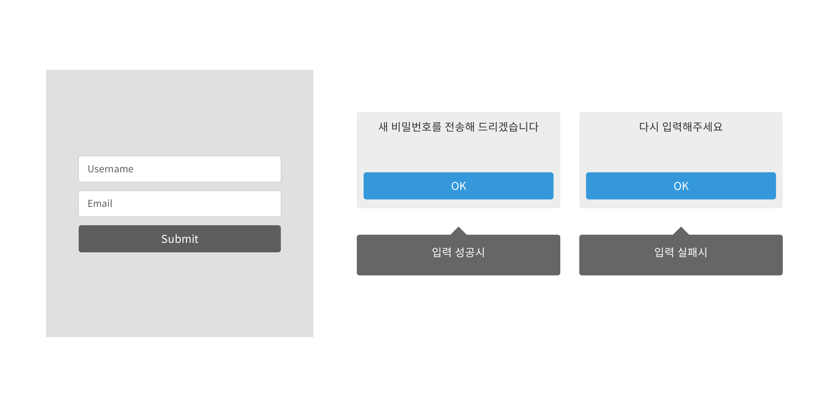

# 취미 블로그
## 1. 목표와 기능
### 1.1 목표
- 다양한 기능 구현
- Django와 친해지기
### 1.2 기능
- 공통
  - 토글 - 회원가입 / 로그인 버튼
  - 토글 메뉴 - 프로필 / 로그아웃
  - 검색
  - 카테고리, 해당 카테고리 목록 카운트
  - 홈버튼
- 메인페이지
  - 게시글 리스트
  - 게시글 작성
- 상세페이지
  - 해당 게시글 수정 및 삭제
  - 제목, 작성자, 조회수, 작성 시간, 수정 시간, 카테고리
  - 이미지, 본문, 파일 다운로드, 댓글 CRUD, 대댓글
- 로그인페이지
  - 일반 로그인 / 구글 로그인
  - 회원가입
- 프로필페이지
  - 프로필 이미지 
  - 썸네일 이미지
  - 프로필 편집
- 프로필 편집페이지
  - 이름, 성, 닉네임, 프로필사진, 비밀번호 수정

### 1.3 팀 구성
- 개인 프로젝트

## 2. 개발 환경 및 배포 URL
### 2.1 개발 환경
  - Web Framework
    - Django 5.0.3 (Python 3.11.7)
  - 서비스 배포 환경
    - Amazon Lightsail
### 2.2 배포 URL
  - URL
  - 관리자
    ```
    id : pjh
    pw : pjh1234!!
    ```
  - 일반 유저
    ```
    id : pjh1
    pw : pjh11234!!
    ```
  - 구글 로그인 유저
### 2.3 URL 구조(모놀리식)
#### Accounts 앱 (Django Allauth 사용)

accounts 앱은 사용자 인증 및 관리를 위해 Django 프로젝트에 통합된 앱입니다. 이 앱은 django-allauth 패키지를 사용하여 구현되었으며, 사용자 로그인, 로그아웃, 회원가입, 소셜 로그인 등의 기능을 제공합니다. 이를 통해 사용자 경험(UX)을 대폭 향상합니다.

#### 기능
- 회원가입: 사용자는 이메일 주소, 아이디, 비밀번호를 사용하여 계정을 생성할 수 있습니다. 

- 로그인/로그아웃: 사용자는 아이디와 비밀번호를 사용하여 로그인할 수 있으며, 로그아웃도 가능합니다.

- 소셜 로그인: 페이스북, 구글, 트위터 등 여러 소셜 미디어 계정을 사용하여 로그인할 수 있습니다.

- 계정 관리: 사용자는 비밀번호 변경, 이메일 주소 추가 및 변경 등의 계정 관리 기능을 사용할 수 있습니다. 
  
- 비밀번호 재설정: 비밀번호를 잊은 사용자는 이메일을 통해 비밀번호를 재설정할 수 있습니다.


#### Blog 앱


| App       | URL                                        | Views Function               | HTML File Name            |  Note           |
|-----------|--------------------------------------------|------------------------------|-------------------------------|----------------|
| blog	    | 'blog/'				         | PostList.as_view()		| blog/post_list.html		| 메인페이지|
| blog	    | 'blog/int:pk/'			         | PostDetail.as_view()		| blog/post_detail.html		|상세페이지|
| blog	    | 'blog/category/str:slug/'		         | category_page		| blog/post_list.html	        | 카테고리페이지  |
| blog 	    | 'blog/tag/str:slug/'			 | tag_page			| blog/post_list.html		| 태그페이지      |
| blog	    | 'blog/create_post/'			 | PostCreate.as_view()		| blog/post_form.html		| 게시글 작성     |
| blog	    | 'blog/update_post/int:pk/'		 | PostUpdate.as_view()		| blog/post_update_form.html	| 게시글 수정      |
| blog	    | 'blog/delete_post/int:pk/'		 | PostDelete.as_view()		| blog/post_list.html   	| 게시글 삭제      |
| blog	    | 'blog/search/str:q/'			 | PostSearch.as_view()		| blog/post_list.html		| 검색            |
| blog	    | 'blog/int:pk/create_comment/'		 | create_comment	 	| blog/post_detail.html		| 댓글 작성        |
| blog	    | 'blog/update_comment/int:pk/'		 | CommentUpdate.as_view()	| blog/comment_form.html	| 댓글 수정       |
| blog	    | 'blog/delete_comment/int:pk/'		 | delete_comment 		| blog/post_detail.html         | 댓글 삭제       |
| blog	    | 'blog/create_recomment/int:pk/'	         | create_recomment		| blog/post_detail.html 	| 대댓글 작성      |
| blog	    | 'blog/update_recomment/int:pk/'	         | ReCommentUpdate.as_view()	| blog/recomment_form.html 	| 대댓글 수정      |
| blog	    | 'blog/delete_recomment/int:pk/'	         | delete_recomment 		| blog/post_detail.html         | 대댓글 삭제      |
| blog	    | 'blog/profile/int:pk/'		         | profile			| blog/profile.html		| 프로필       |
| blog	    | 'blog/update_profile/int:pk/'		 | ProfileUpdate.as_view()	| blog/profile_update.html	| 프로필 수정      |
| blog	    | 'blog/change_password/'		         | ChangePassword.as_view()	| blog/change_password.html	| 비밀번호 변경       |


## 3. 기능 명세

## 4. 프로젝트 구조와 개발 일정
### 4.1 프로젝트 구조
```
📦my-hobby-blog
 ┣ 📂accounts
 ┣ 📂blog
 ┃ ┣ 📂static
 ┃ ┃ ┗ 📂blog
 ┃ ┃ ┃ ┣ 📂bootstrap
 ┃ ┃ ┃ ┃ ┣ 📂assets
 ┃ ┃ ┃ ┃ ┃ ┗ 📜favicon.ico
 ┃ ┃ ┃ ┃ ┣ 📂css
 ┃ ┃ ┃ ┃ ┃ ┗ 📜styles.css
 ┃ ┃ ┃ ┃ ┣ 📂js
 ┃ ┃ ┃ ┃ ┃ ┗ 📜scripts.js
 ┃ ┃ ┃ ┃ ┗ 📜index.html
 ┃ ┃ ┃ ┗ 📂images
 ┃ ┃ ┃ ┃ ┗ 📜default_profile.png
 ┃ ┣ 📂templates
 ┃ ┃ ┗ 📂blog
 ┃ ┃ ┃ ┣ 📜base.html
 ┃ ┃ ┃ ┣ 📜base_full_width.html
 ┃ ┃ ┃ ┣ 📜comment_form.html
 ┃ ┃ ┃ ┣ 📜post_detail.html
 ┃ ┃ ┃ ┣ 📜post_form.html
 ┃ ┃ ┃ ┣ 📜post_list.html
 ┃ ┃ ┃ ┣ 📜post_update_form.html
 ┃ ┃ ┃ ┣ 📜profile.html
 ┃ ┃ ┃ ┣ 📜profile_update.html
 ┃ ┃ ┃ ┗ 📜recomment_form.html
 ┃ ┣ 📜admin.py
 ┃ ┣ 📜apps.py
 ┃ ┣ 📜forms.py
 ┃ ┣ 📜models.py
 ┃ ┣ 📜tests.py
 ┃ ┣ 📜urls.py
 ┃ ┣ 📜views.py
 ┃ ┗ 📜__init__.py
 ┣ 📂config
 ┃ ┣ 📜asgi.py
 ┃ ┣ 📜settings.py
 ┃ ┣ 📜urls.py
 ┃ ┣ 📜wsgi.py
 ┃ ┗ 📜__init__.py
 ┣ 📂media
 ┃ ┣ 📂blog
 ┃ ┃ ┣ 📂files
 ┃ ┃ ┃ ┗ 📂2024
 ┃ ┃ ┃ ┃ ┗ 📂03
 ┃ ┃ ┃ ┃ ┃ ┣ 📂07
 ┃ ┃ ┃ ┃ ┃ ┃ ┣ 📜test.txt
 ┃ ┃ ┃ ┃ ┃ ┃ ┗ 📜test.xlsx
 ┃ ┃ ┃ ┃ ┃ ┗ 📂11
 ┃ ┃ ┃ ┃ ┃ ┃ ┣ 📜test.txt
 ┃ ┃ ┃ ┃ ┃ ┃ ┗ 📜test.xlsx
 ┃ ┃ ┗ 📂images
 ┃ ┃ ┃ ┣ 📂2024
 ┃ ┃ ┃ ┃ ┗ 📂03
 ┃ ┃ ┃ ┃ ┃ ┣ 📂07
 ┃ ┃ ┃ ┃ ┃ ┃ ┗ 📜자연이미지.jpg
 ┃ ┃ ┃ ┃ ┃ ┗ 📂11
 ┃ ┃ ┃ ┃ ┃ ┃ ┗ 📜자연이미지.jpg
 ┃ ┃ ┃ ┗ 📂thumbnail
 ┃ ┃ ┃ ┃ ┗ 📂2024
 ┃ ┃ ┃ ┃ ┃ ┗ 📂03
 ┃ ┃ ┃ ┃ ┃ ┃ ┗ 📂12
 ┃ ┃ ┃ ┃ ┃ ┃ ┃ ┣ 📜default_profile.png
 ┃ ┃ ┃ ┃ ┃ ┃ ┃ ┣ 📜보드와테이블.jpg
 ┃ ┃ ┃ ┃ ┃ ┃ ┃ ┣ 📜석양과도시.jpg
 ┃ ┃ ┃ ┃ ┃ ┃ ┃ ┣ 📜섬과바다.jpg
 ┃ ┃ ┃ ┃ ┃ ┃ ┃ ┣ 📜자연이미지.jpg
 ┃ ┃ ┃ ┃ ┃ ┃ ┃ ┗ 📜햇빛이미지.jpg
 ┣ 📂templates
 ┃ ┣ 📂account
 ┃ ┣ 📂allauth
 ┣ 📜db.sqlite3
 ┣ 📜manage.py
 ┣ 📜README.md
 ┗ 📜requirements.txt
```
### 4.2 WBS


## 5. 와이어프레임 / UI
### 5.1 와이어프레임
<table>
    <tbody>
        <tr>
            <td>메인</td>
            <td>세부페이지</td>
        </tr>
        <tr>
            <td>
		
            </td>
            <td>
                
            </td>
        </tr>
        <tr>
            <td>카테고리 조회</td>
            <td>태그 조회</td>	
        </tr>
        <tr>
            <td>
                
            </td>
            <td>
                
            </td>
        </tr>
        <tr>
            <td>포스트 작성</td>
            <td>포스트 수정</td>
        </tr>
        <tr>
            <td>
                
            </td>
            <td>
                
            </td>
        </tr>
        <tr>
            <td>댓글</td>
            <td>로그인</td>
        </tr>
        <tr>
            <td>
	        
            </td>
            <td>
                
            </td>
        </tr>
        <tr>
            <td>회원가입</td>
            <td>아이디찾기</td>
        </tr>
        <tr>
            <td>
                
            </td>
	    <td>
                
            </td>
        </tr>
	<tr>
            <td>비밀번호찾기</td>
            <td>비밀번호 변경</td>
        </tr>
        <tr>
            <td>
                
            </td>
	    <td>
                
            </td>
        </tr>
 	<tr>
            <td>프로필</td>
            <td>프로필 수정</td>
        </tr>
        <tr>
            <td>
                
            </td>
	    <td>
                
            </td>
        </tr>
    </tbody>
</table>

### 5.2 화면 설계
<table>
    <tbody>
        <tr>
            <td>메인</td>
            <td>세부페이지</td>
        </tr>
        <tr>
            <td>
		
            </td>
            <td>
                
            </td>
        </tr>
        <tr>
            <td>카테고리 조회</td>
            <td>태그 조회</td>	
        </tr>
        <tr>
            <td>
                
            </td>
            <td>
                
            </td>
        </tr>
        <tr>
            <td>포스트 작성</td>
            <td>포스트 수정</td>
        </tr>
        <tr>
            <td>
                
            </td>
            <td>
                
            </td>
        </tr>
        <tr>
           <td>댓글</td>
           <td>로그인</td>
        </tr>
        <tr>
            <td>
	        
            </td>
            <td>
                
            </td>
        </tr>
        <tr>
            <td>회원가입</td>
            <td>아이디찾기</td>
        </tr>
        <tr>
            <td>
                
            </td>
            <td>
                
            </td>
        </tr>
	<tr>
            <td>비밀번호찾기</td>
            <td>비밀번호 변경</td>
        </tr>
        <tr>
            <td>
                
            </td>
	    <td>
                
            </td>
        </tr>
 	<tr>
            <td>프로필</td>
            <td>프로필 수정</td>
        </tr>
        <tr>
            <td>
                
            </td>
	    <td>
                
            </td>
        </tr>
    </tbody>
</table>

## 6. 데이터베이스 모델링(ERD)


