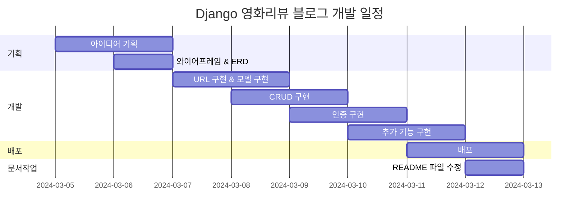
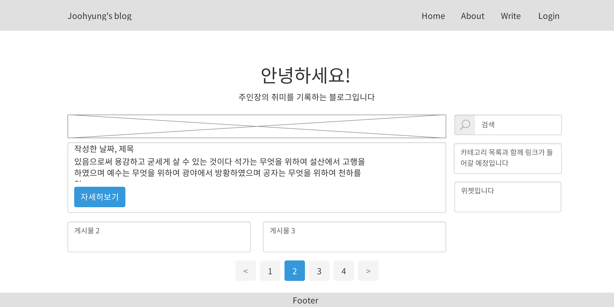
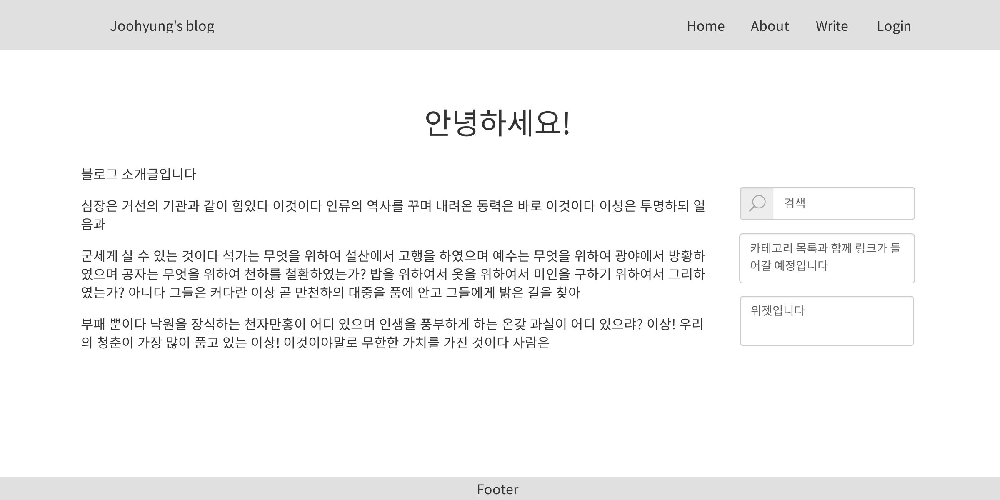
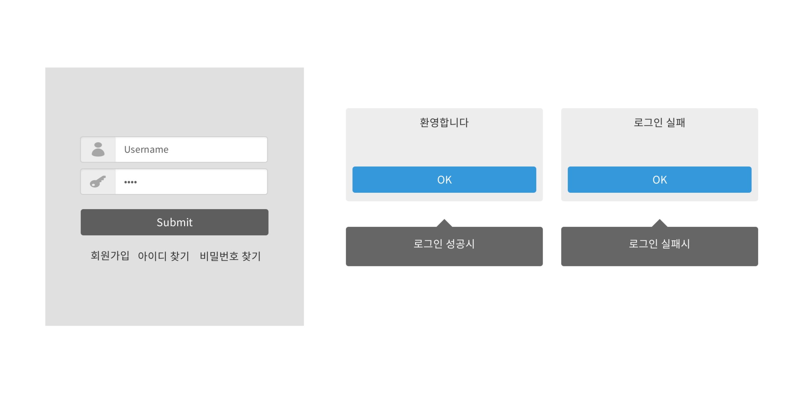
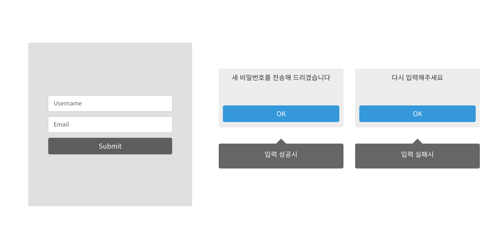
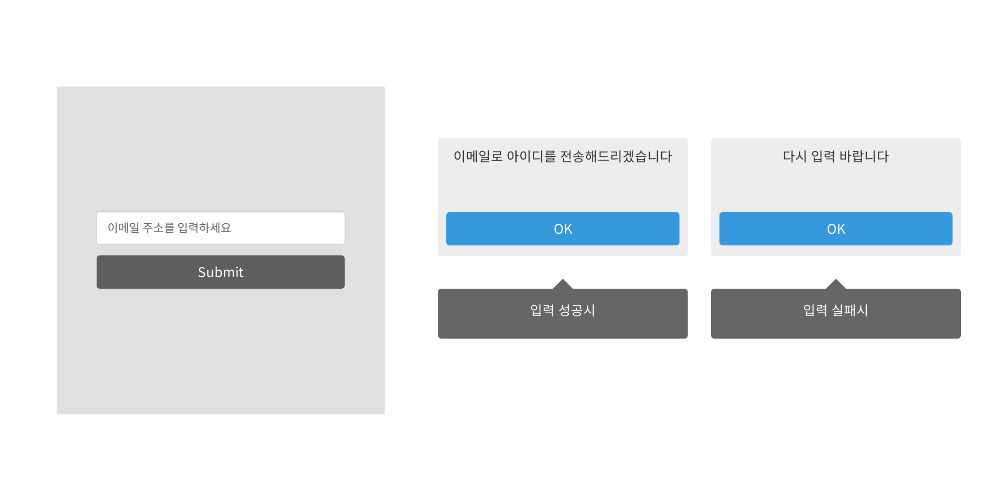
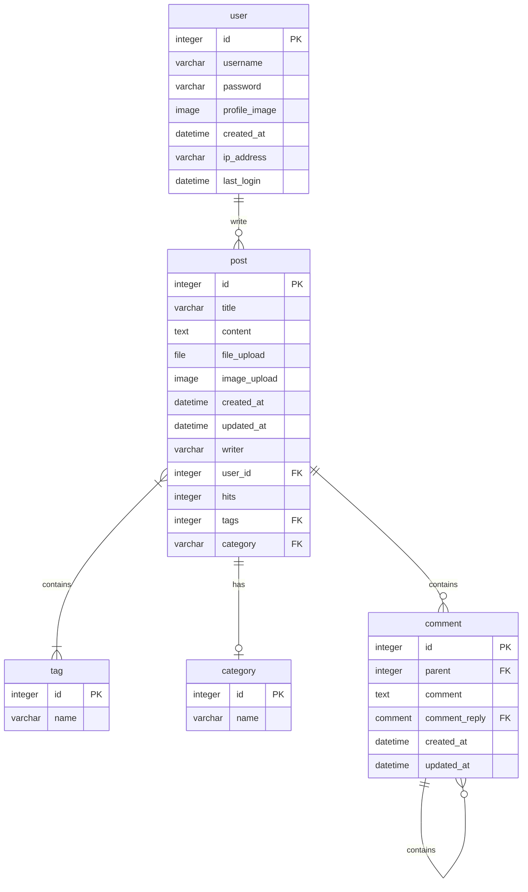

# 취미 블로그
## 1. 목표와 기능
### 1.1 목표
- 다양한 기능 구현
- Django와 친해지기
### 1.2 기능
- 공통
  - 토글 - 회원가입 / 로그인 버튼
  - 토글 메뉴 - 프로필 / 로그아웃
  - 검색
  - 카테고리, 해당 카테고리 목록 카운트
  - 홈버튼
- 메인페이지
  - 게시글 리스트
  - 게시글 작성
- 상세페이지
  - 해당 게시글 수정 및 삭제
  - 제목, 작성자, 조회수, 작성 시간, 수정 시간, 카테고리
  - 이미지, 본문, 파일 다운로드, 댓글 CRUD, 대댓글
- 로그인페이지
  - 일반 로그인 / 구글 로그인
  - 회원가입
- 프로필페이지
  - 프로필 이미지 
  - 썸네일 이미지
  - 프로필 편집
- 프로필 편집페이지
  - 이름, 성, 닉네임, 프로필사진, 비밀번호 수정

### 1.3 팀 구성
- 개인 프로젝트

## 2. 개발 환경 및 배포 URL
### 2.1 개발 환경
  - Web Framework
    - Django 5.0.3 (Python 3.11.7)
  - 서비스 배포 환경
    - Amazon Lightsail
### 2.2 배포 URL
  - URL
  - 관리자
    ```
    id : pjh
    pw : pjh1234!!
    ```
  - 일반 유저
    ```
    id : pjh1
    pw : pjh11234!!
    ```
  - 구글 로그인 유저
### 2.3 URL 구조(모놀리식)
- accounts (Django Allauth 사용)

accounts 앱은 사용자 인증 및 관리를 위해 Django 프로젝트에 통합된 앱입니다. 이 앱은 django-allauth 패키지를 사용하여 구현되었으며, 사용자 로그인, 로그아웃, 회원가입, 소셜 로그인 등의 기능을 제공합니다. 이를 통해 사용자 경험(UX)을 대폭 향상합니다.

#### 기능
- 회원가입: 사용자는 이메일 주소, 아이디, 비밀번호를 사용하여 계정을 생성할 수 있습니다. 

- 로그인/로그아웃: 사용자는 아이디와 비밀번호를 사용하여 로그인할 수 있으며, 로그아웃도 가능합니다.

- 소셜 로그인: 페이스북, 구글, 트위터 등 여러 소셜 미디어 계정을 사용하여 로그인할 수 있습니다.

- 계정 관리: 사용자는 비밀번호 변경, 이메일 주소 추가 및 변경 등의 계정 관리 기능을 사용할 수 있습니다. 
  
- 비밀번호 재설정: 비밀번호를 잊은 사용자는 이메일을 통해 비밀번호를 재설정할 수 있습니다.


- blog

  
| App       | URL                                        | Views Function    | HTML File Name                        | Note           |
|-----------|--------------------------------------------|-------------------|---------------------------------------|----------------|
blog	|'blog/'					|PostList.as_view()		|blog/post_list.html		|게시판 메인 화면|
blog	|'blog/int:pk/'					|PostDetail.as_view()		|blog/post_detail.html		|상세 포스트 화면|
blog	|'blog/category/str:slug/'			|category_page			|blog/category_page.html	|카테고리별 포스트 보기|
blog	|'blog/tag/str:slug/'				|tag_page			|blog/tag_page.html		|태그별 포스트 보기|
blog	|'blog/create_post/'				|PostCreate.as_view()		|blog/post_form.html		|포스트 작성, 카테고리 지정, 사진 업로드|
blog	|'blog/update_post/int:pk/'			|PostUpdate.as_view()		|blog/post_update.html		|포스트 수정|
blog	|'blog/delete_post/int:pk/'			|PostDelete.as_view()		|blog/post_confirm_delete.html	|포스트 삭제|
blog	|'blog/search/str:q/'				|PostSearch.as_view()		|blog/post_search.html		|검색 기능|
blog	|'post/int:pk/new_comment/'			|new_comment			|blog/comment_form.html		|댓글 입력 폼|
blog	|'post/update_comment/int:pk/'			|CommentUpdate.as_view()	|blog/comment_update.html	|댓글 업데이트|
blog	|'post/delete_comment/int:pk/'			|delete_comment 		|blog/comment_confirm_delete.html|댓글 삭제|
blog	|'create_recomment/int:pk/'			|create_recomment		|blog/recomment_form.html	|대댓글 입력 폼 |
blog	|'change_password/'				|ChangePassword.as_view()	|blog/change_password.html	|비밀번호 변경|
blog	|'profile/int:pk/'				|profile			|blog/profile.html		|프로필 보기|
blog	|'update_profile/int:pk/'			|ProfileUpdate.as_view()	|blog/profile_update.html	|프로필 업데이트|


## 3. 요구사항 명세와 기능 명세

## 4. 프로젝트 구조와 개발 일정
### 4.1 프로젝트 구조
### 4.2 WBS


## 5. 와이어프레임 / UI
### 5.1 와이어프레임
<table>
    <tbody>
        <tr>
            <td>메인</td>
            <td>세부페이지</td>
        </tr>
        <tr>
            <td>
		
            </td>
            <td>
                
            </td>
        </tr>
        <tr>
            <td>About 페이지</td>
            <td>글쓰기</td>
        </tr>
        <tr>
            <td>
                
            </td>
            <td>
                
            </td>
        </tr>
        <tr>
            <td>수정</td>
            <td>로그인</td>
        </tr>
        <tr>
            <td>
                
            </td>
            <td>
                
            </td>
        </tr>
        <tr>
            <td>비밀번호찾기</td>
            <td>아이디찾기</td>
        </tr>
        <tr>
            <td>
	        
            </td>
            <td>
                
            </td>
        </tr>
        <tr>
            <td>회원가입</td>
        </tr>
        <tr>
            <td>
                
            </td>
        </tr>
    </tbody>
</table>

### 5.2 화면 설계

## 6. 데이터베이스 모델링(ERD)

