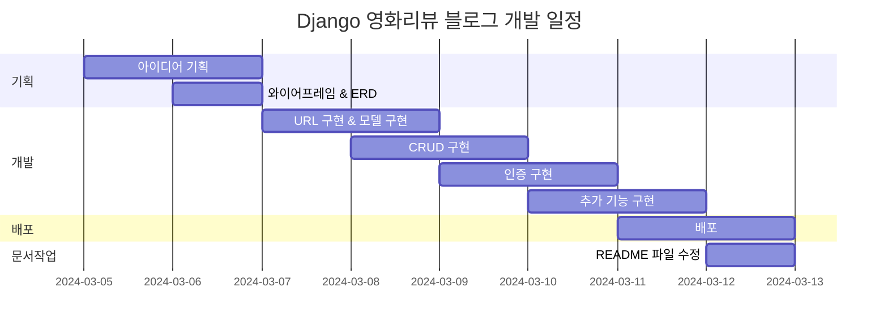

# 영화 리뷰 블로그
## 1. 목표와 기능
### 1.1 목표
- 모두가 볼 수 있는 취미 블로그
- Django와 친해지기
### 1.2 기능
- 기본적인 CRUD
- 로그인 / 회원가입
- 회원 관련 추가 기능
- 댓글 기능
- 간편 로그인 기능
### 1.3 팀 구성
- 개인 프로젝트

## 2. 개발 환경 및 배포 URL
### 2.1 개발 환경
  - Web Framework
    - Django 5.0.2 (Python 3.12.1)
  - 서비스 배포 환경
    - Amazon Lightsail
### 2.2 배포 URL
  - URL
  - 테스트용 계정
    ```
    id : test@gmail.com
    pw : test1234!!
    ```
### 2.3 URL 구조(모놀리식)
- main

| App       | URL                                        | Views Function    | HTML File Name                        | Note           |
|-----------|--------------------------------------------|-------------------|---------------------------------------|----------------|
| main      | '/'                                        | home              | main/home.html                        | 홈화면          |
| main      | '/about/'                                  | about             | main/about.html                       | 소개화면               |


- accounts

| App       | URL                                        | Views Function    | HTML File Name                        | Note           |
|-----------|--------------------------------------------|-------------------|---------------------------------------|----------------|
| accounts  | 'signup/'                                  | signup          | accounts/signup.html                |회원가입         |
| accounts  | 'login/'                                   | login             | accounts/login.html                   |로그인           |
| accounts  | 'logout/'                                  | logout            | accounts/logout.html                  |로그아웃         |
| accounts  | 'profile/'                                 | profile           | accounts/profile.html                 | 비밀번호변경기능 / <br>프로필 수정/ 닉네임추가 |


- blog


| App       | URL                                        | Views Function    | HTML File Name                        | Note           |
|-----------|--------------------------------------------|-------------------|---------------------------------------|----------------|
| blog      | 'blog/'                                    | blog_list          | blog/blog_list.html                        |갤러리형 게시판 메인 화면  |
| blog      | 'blog/<int:pk>/'                           | blog_detail        | blog/blog_detail.html                        |상세 포스트 화면    |
| blog      | 'blog/write/'                              | blog_create        | blog/blog_create.html                       | 카테고리 지정, 사진업로드,<br> 게시글 조회수 반영|
| blog      | 'blog/edit/<int:pk>/'                      | blog_update       | blog/blog_update.html                        | 게시물목록보기 |
| blog      | 'blog/delete/<int:pk>/'                    | blog_delete       | blog/delete.html                      | 삭제 화면      |
| blog      | 'blog/search/'                             | search            | blog/search.html                      | 주제와 카테고리에 따라 검색,<br> 시간순에 따라 정렬|
| blog      | 'post/<int:post_pk>/comment/'              | comment_new       | blog/comment_form.html                | 댓글 입력 폼     |
| blog      | 'post/<int:post_pk>/comment/<br><int:parent_pk>/' | reply_new    | blog/comment_form.html                | 대댓글 폼      |
| blog      | 'post/<int:pk>/like/'                      | like_post         | blog/post.html                        |좋아요를 누르면 blog/post로 Redirect됨|
| blog      | 'comment/<int:pk>/update/'                 | comment_update    | blog/comment_form.html                |댓글 업데이터 경로   |
| blog      | 'comment/<int:pk>/delete/'                 | comment_delete    | blog/comment_<br>confirm_delete.html      |댓글 삭제 폼    |


## 3. 요구사항 명세와 기능 명세

## 4. 프로젝트 구조와 개발 일정
### 4.1 프로젝트 구조
### 4.2 WBS


## 5. 와이어프레임 / UI
### 5.1 와이어프레임
<table>
    <tbody>
        <tr>
            <td>메인</td>
            <td>로그인</td>
        </tr>
        <tr>
            <td>
		
            </td>
            <td>
                
            </td>
        </tr>
        <tr>
            <td>회원가입</td>
            <td>정보수정</td>
        </tr>
        <tr>
            <td>
                
            </td>
            <td>
                
            </td>
        </tr>
        <tr>
            <td>검색</td>
            <td>번역</td>
        </tr>
        <tr>
            <td>
                
            </td>
            <td>
                
            </td>
        </tr>
        <tr>
            <td>선택삭제</td>
            <td>글쓰기</td>
        </tr>
        <tr>
            <td>
	        
            </td>
            <td>
                
            </td>
        </tr>
        <tr>
            <td>글 상세보기</td>
            <td>댓글</td>
        </tr>
        <tr>
            <td>
                
            </td>
            <td>
                
            </td>
        </tr>
    </tbody>
</table>


